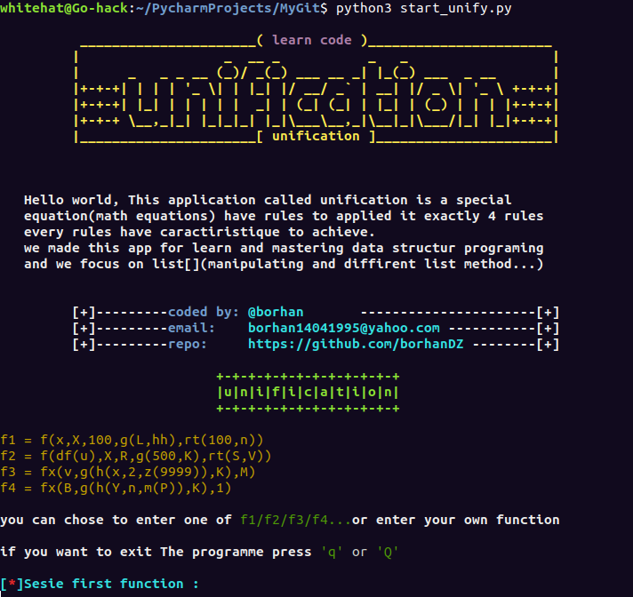
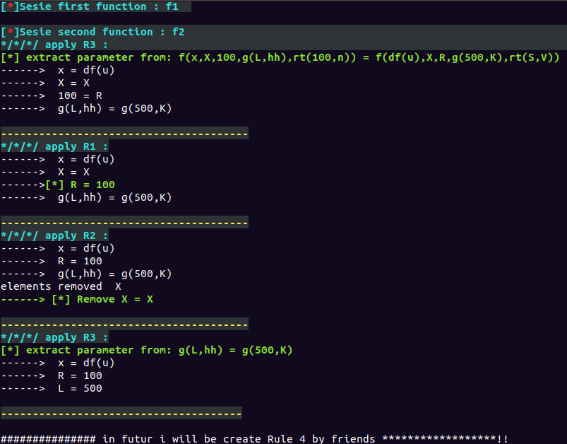

                                          
#### Overview
this programm it made to learn the important uses of data structur on developement cycle when you go to make your application
we focus on list `[]` and string (without using regex code) how manuplate, also will give you a strong knowlodge about use them and see the profit of using lists in programming and how much we need them during build an application.

# Susbstitution and Uniffication

the unification of two terms **T** and **T'** with variables ***x1, x2, .... xn*** consists in finding a substitution of these
variables by terms ***u1, u2, .... un*** one such as the application
of this substitution makes the terms **T** and **T'** equal.
- applying a substitution ***O = {x1/u1, x2/u2, .... xn/un}*** at a term **T**, produces a new term **T'** obtained by
  replacing each occurrence of **xi** by **ui** in **T**.
- Two formulas are unified, if there is a substitution **O** such that **TO** = **T’O**. 
 and **O** it call to unify **T** and **T’**
>### important note
> *what signify '**term**': term= function/{f(a,..,g(z)),...,heq(55,V)} **or** variable:{A,B,C,...,Z} **or** constant:{Numbers{1,2,...,n}/ words{ab,abc,...,e,d,...,bc..n}}*
## Unification of two predicates:
Let ***P1(t1, t2, ......,tn)*** and ***P2(t1’, t2’, .........,tm’)***
If ***(P1 ≠ P2)*** or ***(P1 = P2 and n ≠ m)*** then the unification is impossible
otherwise if **P1 = P2** and **n = m** then unification will be possible if we
can unify the terms **ti** and **ti’** 2 to 2.
## Unification Algorithme
in this section we're going to express and show **rules** exactly 4 rules which those rules represent the principal part of our program the unification algorithm.
- **rule 1:** Convert **t = x** to **x = t** if **x** is a variable and **t** is not a variable.
- **rule 2:** delete operations of the form **x = x**.
- **rule 3:** Let say **t’= t’’** which **t’** and **t’’** are not variables, if the functions of **t'** and **t''** are not the same then unification is impossible. 
``` 
             otherwise replace the equation f(x1’, x2’,..., xn’) = f(x1’’, x2’’,..., xn’')
                                          with the equations x1’ = x1’’
                                                             x2’ = x2’’
                                                             ........
                                                             xn’ = xn’’
```
- **rule 4:** we have **x = t** be an equation such that **x** has another occurrence in the set of equations if **x** is in t then no unification possible otherwise transform all the equations by replacing all the **x** by **t**.                                                          
### Théorème 
- if unification algorithm ends in failure then there is no possible unification for all the equations.
- if it is successful then the set of equations is in a solved form.
### examples
##### exm1:(with possible unification)
we have next two function 1) **f(x,h(x),y,g(y)), 2)f(g(z),w,z,x)** we're going to apply unification on 1 and  2.                                                     
first, always start apply rule3 and then apply rules until finish cases in apply any rule.
```
1/ apply rule3 : f(x, h(x),y,g(y)) = f(g(z),w,z,x) # note the two function has same name **f** and same number of parameter equal 4.
         x = g(z)
         h(x) = w
         y = z
         g(y) = x
 2/ apply rule1 : change t = x to x = t and x ∈ {variables}
         x = g(z)
   ----* w = h(x) 
         y = z
   ----* x = g(y) 
 3/ apply rule4 : change x on all equation with g(z).
         x = g(z)
   ----* w = h(g(z)) 
         y = z
   ----* g(z) = g(y) 
 4/ apply rule3 : g(z) = g(y)
         x = g(z)
         w = h(g(z)) 
         y = z
   ----* z = y
5/ apply rule4 : change z with y
         x = g(z)
         w = h(g(z)) 
         y = z
   ----* y = y
6/ apply rule2 : delete y = y
         x = g(z)
         w = h(g(z)) 
         y = z
 the unification is possible, the substitution O = {x/g(z),  y/z,  w/h(g(z))}.
```

##### exm2:(with impossible unification)
> warning: only rule 3 and rule 4 cause impossible unification.
we'll see two case.

- **case one**
```
1)go(N,h(K,5),ahmed)
2)go(f(Y),N,Y)

1/ apply rule3 : go(N,h(K,5),ahmed) = go(f(Y),N,Y)
         N = f(Y)
         h(k,5) = N
         ahmed = Y
2/ apply rule1 :
   ----* N = f(Y)
         N = h(k,5)
   ----* Y = ahmed
3/ apply rule4 :
         N = f(Y)
   ----* f(Y) = h(k,5)
         Y = ahmed
impposible unification can't apply rule3 at f(Y) = h(k,5) not the same name or parameter
```
- **case tow**
```
1) p(Q,g(h(S),B)
2) p(f(X),g(Z),Y)

1/ apply rule3 : p(Q,g(h(S)),B,S) = p(f(X),g(Z),Y,Z)
         Q = f(X)
         g(h(S) = g(Z)
         B = Y
         S = Z
2/ apply rule3 : g(h(S) = g(Z)
         Q = f(X)
  ----*  h(S) = Z
         B = Y
         S = Z
3/ apply rule1 :
         Q = f(X)
  ----*  Z = h(S)
         B = Y
         S = Z
3/ apply rule4 :
         Q = f(X)
  ----*  Z = h(Z)   !oops infinite loop
         B = Y
         S = Z
impposible unification can't apply rule 4 again,cause infinite loop.
```
this screen show execution f1 and f2 inside application also you can write any function or try execute f3,f4



best regard enjoy!

